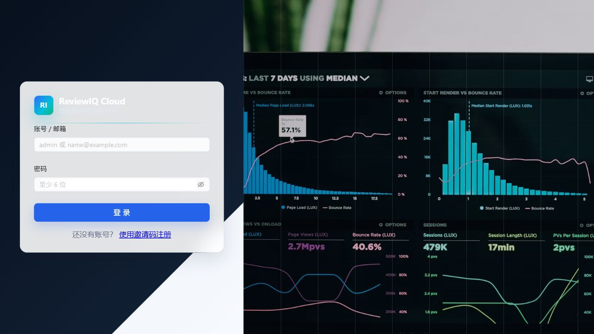
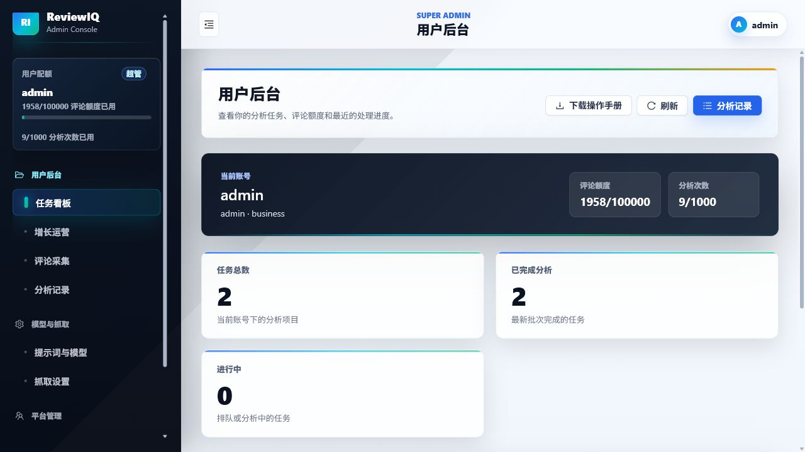
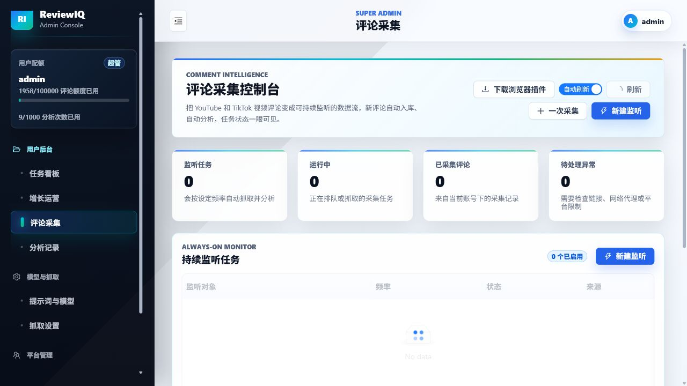
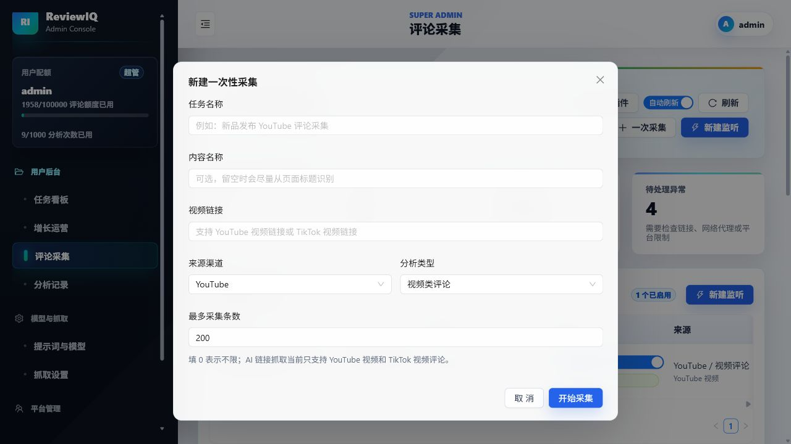
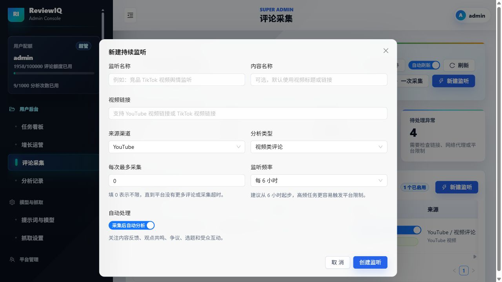
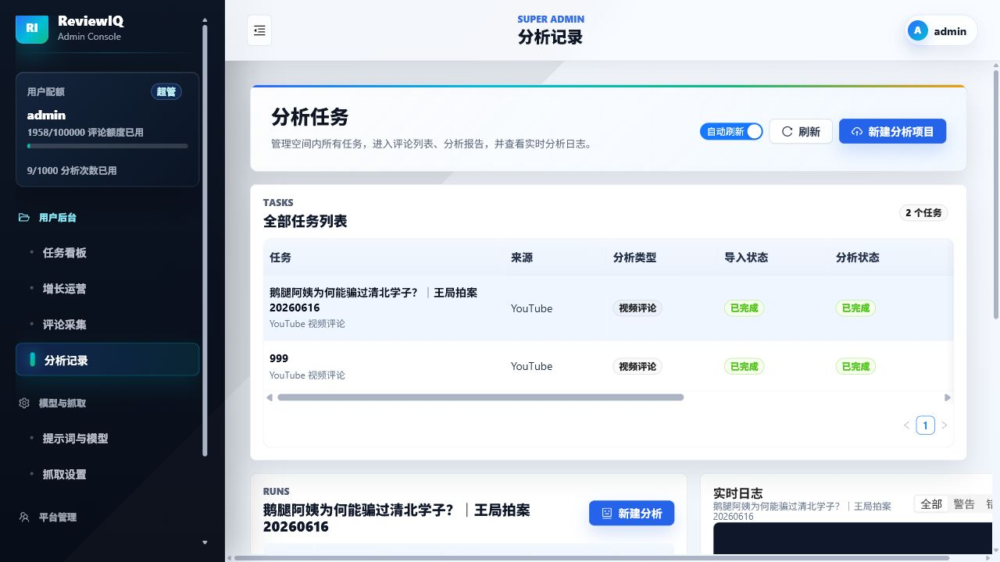
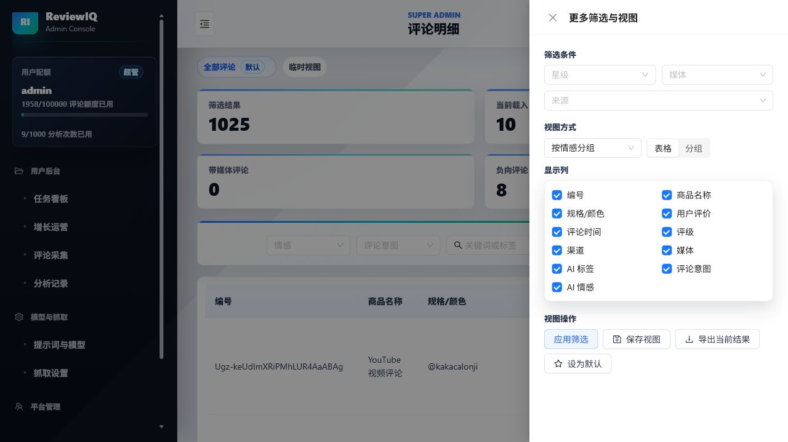
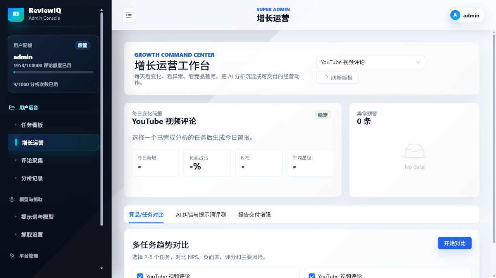
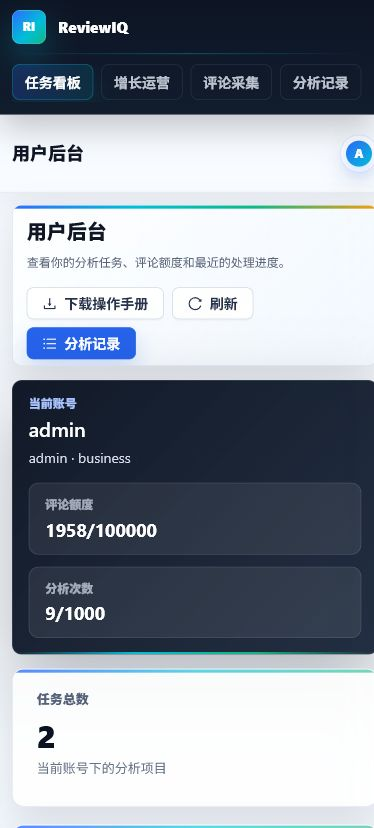

# ReviewIQ 普通用户操作手册

本文档面向普通业务用户、运营人员和内容分析人员，说明如何完成登录、评论采集、持续监听、AI 分析、报告查看、评论复核和移动端使用。

普通用户不需要配置模型、提示词、抓取参数或系统后台。平台会统一使用管理员或超管维护好的 AI 分析配置和评论采集配置。

本次更新覆盖 2026-06-26 前后的功能和 UI 调整：评论明细增加“更多筛选”抽屉和移动端卡片列表，分析记录增加日志级别筛选，采集和分析删除操作改为站内确认弹窗，失败任务支持重试，移动端表格滚动和行动看板布局也已优化。

## 1. 使用范围

普通用户主要使用以下功能：

- 任务看板：查看任务、额度和最近分析状态。
- 评论采集：创建一次性采集任务，或创建持续监听任务。
- 采集记录：查看采集进度、失败原因、重试、删除。
- AI 分析：对已采集评论发起分析，查看分析进度。
- 分析报告：查看情绪、NPS、用户声音、主题、痛点、机会点和行动建议。
- 评论明细：检索、筛选、导出、复核原始评论和 AI 标注。
- 增长运营：把评论洞察转成待跟进事项。
- 移动端：在手机上查看状态、刷新任务和处理轻量操作。

普通用户不会维护以下内容：

- AI 模型、API Key、提示词模板。
- 抓取引擎、代理、超时、滚动策略等采集底层参数。
- 用户、工作区、邀请码、额度等后台管理项。

## 2. 登录系统

打开系统地址后进入登录页。

操作步骤：

1. 输入账号。
2. 输入密码。
3. 点击“登录”。
4. 登录成功后进入任务看板。

注意事项：

- 生产环境账号由管理员创建或邀请。
- 如果忘记密码或账号无法登录，请联系管理员处理。
- 如果页面长时间无响应，可以刷新页面后重新登录。
- 如果提示接口异常，通常需要管理员检查服务状态。

## 3. 任务看板

任务看板是登录后的首页，用于快速了解当前工作区的整体状态。

常看信息：

- 评论额度：当前周期已使用和总额度。
- 分析次数：当前周期已使用和总次数。
- 任务总数：当前工作区已有的分析任务数量。
- 已完成分析：已经生成报告的任务数量。
- 进行中：正在排队或分析中的任务数量。
- 最近分析任务：最近创建或更新的任务。

建议日常流程：

1. 每天先看任务看板，确认是否有失败、排队过久或待处理任务。
2. 如果有新采集完成的数据，进入“评论采集”发起 AI 分析。
3. 分析完成后进入分析报告、评论明细或增长运营查看结果。

## 4. 评论采集

评论采集用于从 YouTube、TikTok 等视频链接采集评论，也可以创建持续监听任务。

页面通常包含两类列表：

- 持续监听任务：用于长期跟踪同一个视频或内容链接的新评论。
- 采集记录：用于查看每次采集任务的执行状态和结果。

页面操作区会优先显示常用按钮，例如“一次采集”“新建监听”“刷新”“开始分析”；删除、重试等低频或危险操作通常放在“更多”菜单中，避免按钮过多导致换行。

常见状态：

- 排队中：任务已创建，等待系统执行。
- 抓取中：系统正在访问平台并采集评论。
- 已完成：评论已采集入库，可以开始分析。
- 失败：采集过程出现异常，可以查看错误并重试。

## 5. 创建一次性采集

一次性采集适合临时分析某条视频、某次活动或某个内容链接。

填写说明：

- 任务名称：建议写清平台、内容主题和日期，例如“新品发布 YouTube 评论采集 20260623”。
- 内容名称：可选，用于后续识别内容对象。
- 视频链接：粘贴 YouTube 或 TikTok 视频链接。
- 来源渠道：选择评论来源平台。
- 分析类型：视频类评论请选择“视频类评论”。商品评论、社媒评论应选择对应类型，避免分析维度不匹配。
- 最多采集条数：控制本次最多采集多少条评论。填 `0` 通常表示不限制，但实际数量仍受平台、网络和系统策略影响。

操作步骤：

1. 进入“评论采集”。
2. 点击“一次采集”。
3. 填写任务名称、链接、来源渠道和分析类型。
4. 设置最多采集条数。
5. 点击“开始采集”。
6. 在“采集记录”中查看进度。

采集完成后：

- 如果采集到评论，点击“开始分析”进入 AI 分析流程。
- 如果没有采集到评论，先确认链接是否公开、评论区是否开启、平台是否需要登录或地区权限。
- 如果任务失败，可以点击“重试”。
- 如果任务不再需要，可以点击“删除”清理记录。
- 点击“删除”后会出现确认弹窗，请先核对任务名称、链接和删除影响，再确认操作。

## 6. 创建持续监听

持续监听适合长期跟踪同一条视频或内容链接的新评论。系统会按设定频率自动采集，并可选择采集后自动分析。

填写说明：

- 监听名称：建议包含平台、对象和用途，例如“YouTube 新视频舆情监听”。
- 内容名称：可选，用于识别被监听内容。
- 视频链接：填写需要长期监听的链接。
- 来源渠道：选择评论来源平台。
- 分析类型：选择视频评论、商品评论或社媒评论等对应类型。
- 单次最大采集：每次运行最多采集多少条评论。
- 运行频率：例如每 6 小时运行一次。
- 自动分析：开启后，每次采集完成会自动进入 AI 分析流程。

操作步骤：

1. 点击“新建监听”。
2. 填写监听信息。
3. 设置运行频率和单次最大采集数量。
4. 根据需要开启“自动分析”。
5. 保存后在“持续监听任务”中查看。

监听任务常用操作：

- 启用或暂停：控制监听是否继续按频率运行。
- 立即运行：不等下一次计划时间，马上执行一次采集。
- 查看分析：进入关联分析任务。
- 删除：删除不再需要的监听任务。

提醒：切换页面后监听任务仍应保留在列表中。如果回到页面后看不到刚创建的监听任务，可以先刷新页面；仍不存在时请联系管理员查看接口或数据库记录。删除监听任务时，历史采集记录和分析任务通常不会被自动删除，但仍要以弹窗提示为准。

## 7. 采集失败、重试和删除

采集失败时，先看失败提示，再决定是否重试。

建议排查顺序：

1. 在浏览器中打开链接，确认内容可以正常访问。
2. 确认视频或内容评论区已开启。
3. 确认来源渠道选择正确，例如 YouTube 链接不要选成 TikTok。
4. 确认最多采集条数是否过大，必要时先小批量测试。
5. 如果多次超时或无评论，请联系管理员检查服务器网络、代理和抓取设置。

重试适合以下情况：

- 网络临时波动。
- 平台加载慢导致超时。
- 系统 worker 暂时繁忙。
- 任务排队后异常中断。

删除适合以下情况：

- 链接填错。
- 任务重复创建。
- 测试任务不再需要。
- 采集记录已经确认无价值。

删除注意事项：

- 删除前确认任务名称和链接。
- 系统会使用站内确认弹窗提示删除影响范围，确认前请仔细阅读。
- 删除后通常不可恢复。
- 删除采集记录不一定等于删除已生成的分析任务，如需清理分析结果，请到“分析记录”中删除对应任务。

## 8. 发起 AI 分析

采集完成后，可以对已采集评论发起 AI 分析。

常见入口：

- 在“评论采集”的采集记录中点击“开始分析”。
- 在“分析记录”中打开对应任务，查看是否已有分析批次。
- 持续监听任务如果开启自动分析，采集完成后会自动进入分析流程。

分析前检查：

1. 评论数量是否符合预期。
2. 分析类型是否正确。
3. 任务名称是否便于后续识别。
4. 是否有重复任务。

视频类评论注意事项：

- YouTube 视频类评论不等同于商品评论。
- 视频类评论更关注内容观点、人物态度、主题讨论、争议点、传播反馈和观众情绪。
- 如果视频类评论分析结果全部负向、NPS 长期为 0，或用户声音全是电商词汇，请确认任务分析类型是否选择正确，并让管理员检查提示词配置。

## 9. 分析记录

分析记录用于查看已经创建的分析任务、分析状态和运行日志。

主要字段：

- 任务：分析任务名称和内容对象。
- 来源：评论来自哪个平台或渠道。
- 类型：视频评论、商品评论或社媒评论。
- 导入状态：评论数据是否已经导入完成。
- 分析状态：AI 是否排队、运行、完成或失败。
- 创建时间：任务创建时间。
- 操作：打开、查看报告、删除等。

分析状态说明：

- 未分析：评论已存在，但还没有发起 AI 分析。
- 排队中：分析任务已进入队列。
- 分析中：AI 正在处理评论。
- 已完成：分析报告已生成。
- 部分失败：部分评论处理失败，但可能仍有可用结果。
- 失败：分析任务失败，需要查看日志或重试。

日志查看建议：

- 先看“全部”了解整体流程。
- 任务失败时切到“错误”，优先定位真正失败原因。
- 如果任务部分失败，可切到“警告”查看是否存在数据格式、评论内容或模型返回异常。
- 删除分析任务前，请确认不再需要评论、分析结果、报告分享和行动项。

如果评论数达到几千或几万条，分析需要等待更久。当前系统已支持批量和并发分析，但实际速度仍取决于模型服务、网络、额度和服务器性能。

## 10. 查看分析报告

分析完成后，打开任务报告查看 AI 输出结果。报告通常包括：

- 总体结论。
- NPS 和情绪分布。
- 用户声音和高频词。
- 核心主题。
- 痛点、机会点和行动建议。
- 可引用的代表性评论。

建议阅读顺序：

1. 先看总体结论，判断整体态度是正向、中性还是负向。
2. 查看 NPS 和情绪分布，理解整体满意度或态度倾向。
3. 查看用户声音和主题词，确认评论主要讨论什么。
4. 查看痛点和机会点，判断哪些问题值得优先处理。
5. 回到评论明细抽查原文，确认报告结论有原始评论支撑。

报告使用建议：

- 面向内部复盘时，可以直接使用报告中的主题、痛点和行动建议。
- 面向外部汇报时，建议先复核代表性评论，避免引用敏感内容。
- 如果结论明显不符合原始评论，请使用评论明细抽样核对，并反馈给管理员调整提示词。

## 11. 评论明细

评论明细用于查看原始评论和 AI 标注结果。

常用能力：

- 搜索：按关键词查找评论。
- 筛选：顶部保留情绪、意图、关键词等常用筛选；评分、媒体、来源渠道、分组方式和展示列在“更多筛选”抽屉中。
- 表格列配置：根据当前工作需要调整展示字段。
- 保存视图：将常用筛选条件保存为视图。
- 导出：导出当前筛选结果。
- 人工修正：对 AI 判断错误的情绪、标签或摘要进行修正。
- 移动端卡片：手机端会用卡片列表展示评论摘要、情绪、意图和时间，并通过分页切换。

建议用法：

- 报告结论有疑问时，回到评论明细抽查原文。
- 做专题分析时，先筛选关键词，再保存视图。
- 交付外部报告前，导出关键评论作为证据。
- 发现 AI 误判时，使用人工修正沉淀反馈。

## 12. 增长运营

增长运营用于把评论洞察转化为运营动作，例如内容选题、问题跟进、用户痛点处理和机会点管理。

常见用途：

- 查看近期用户反馈趋势。
- 对比不同任务或内容的反馈表现。
- 找到高优先级问题。
- 生成可执行的运营建议。
- 跟踪行动项处理状态。

建议流程：

1. 从分析报告定位主要问题。
2. 进入增长运营查看系统整理的机会点。
3. 将可执行事项分配给负责人。
4. 定期复盘处理状态和后续评论变化。

如果从报告或任务进入行动项看板，可以按状态查看“未处理、处理中、已完成”等事项，并快速修改负责人、优先级和截止日期。手机端看板会自动压缩统计卡片和操作按钮，适合轻量跟进。

## 13. 移动端使用

系统会根据当前设备识别 PC 或移动端，并显示对应界面布局。移动端更适合查看状态、快速刷新、查看任务和轻量操作；复杂筛选、大量表格操作和批量复核更建议在 PC 上完成。

移动端建议：

- 使用顶部或底部导航切换主要页面。
- 大表格页面可以横向滚动查看字段，右侧淡出阴影表示还有内容可以滑动。
- 评论明细在手机上会显示为卡片和分页，不需要强行操作宽表格。
- 新建任务时尽量复制完整链接，避免手动输入错误。
- 删除、重试等关键操作前仔细确认当前任务名称。

## 14. 推荐日常工作流

一次性采集和分析流程：

1. 登录系统。
2. 进入“评论采集”。
3. 点击“一次采集”。
4. 填写链接、来源渠道和分析类型。
5. 等待采集完成。
6. 在采集记录中点击“开始分析”。
7. 进入“分析记录”查看分析进度。
8. 分析完成后打开报告。
9. 在“评论明细”中抽查原始评论。
10. 在“增长运营”中整理行动项。

持续监听流程：

1. 进入“评论采集”。
2. 点击“新建监听”。
3. 设置运行频率和单次最大采集数量。
4. 按需开启自动分析。
5. 定期查看监听任务是否运行正常。
6. 出现失败时点击“立即运行”或查看错误后重试。
7. 不再需要时删除监听任务。

## 15. 常见问题

### 15.1 登录失败怎么办？

先确认账号和密码是否正确，再刷新页面重试。如果仍失败，请联系管理员检查账号状态和服务状态。

### 15.2 采集任务一直排队怎么办？

可能是系统 worker 正在处理其他任务，也可能是服务异常。可以先等待几分钟并刷新页面；如果长时间没有变化，请联系管理员查看后台任务队列。

### 15.3 提示未采集到评论怎么办？

请先在浏览器中打开链接，确认评论区可见。常见原因包括评论关闭、链接不支持、平台需要登录、地区权限限制或视频没有公开评论。

### 15.4 只采集到少量评论怎么办？

可能是单次最大采集数设置过低、平台只加载了部分评论、网络超时或平台访问受限。可以提高采集条数、使用持续监听分批采集，或联系管理员检查抓取日志。

### 15.5 分析速度慢怎么办？

大批量评论分析会受到模型服务、网络、额度和服务器性能影响。普通用户可以优先做三件事：

1. 先用较小样本快速验证分析类型和报告质量。
2. 对几万条评论采用分批采集或持续监听。
3. 避免同时创建大量重复分析任务。

底层并发、批量大小和模型配置由管理员统一维护。

### 15.6 视频评论分析像商品评论怎么办？

请确认创建任务时选择了“视频类评论”。如果类型正确但报告仍明显偏向电商词汇，请把任务名称和截图反馈给管理员，由管理员检查提示词和模型配置。

### 15.7 误删任务怎么办？

删除后通常不可恢复。请先确认删除的是采集记录、监听任务还是分析任务。如果误删重要数据，请尽快联系管理员检查是否有数据库备份。

### 15.8 找不到评分、媒体或来源渠道筛选怎么办？

评论明细页顶部只保留高频筛选。评分、是否含媒体、来源渠道、分组和展示列等选项在“更多筛选”抽屉中，点击后即可展开。

## 16. 操作注意事项

- 新建采集时务必选择正确的来源渠道和分析类型。
- 视频类、商品类、社媒类评论不要混用分析类型。
- 删除操作需谨慎，删除后通常不可恢复。
- 大规模评论建议分批处理，避免单次任务过大导致超时。
- 普通用户不需要维护模型和抓取设置，遇到底层配置问题请联系管理员。
- 对外分享报告前，先检查是否包含敏感评论或内部数据。

## 17. 术语表

- 任务：一次评论导入或采集后形成的分析对象。
- 采集记录：一次抓取执行记录。
- 监听任务：按固定频率自动抓取的长期任务。
- 分析记录：AI 对评论执行分析的运行记录。
- NPS：净推荐值，用于衡量整体推荐或态度倾向。视频类评论中应结合内容推荐、观看体验和态度倾向解释。
- 用户声音：评论中反复出现的观点、需求、痛点或主题。
- 行动项：从评论洞察中拆解出的可执行事项。
- 工作区：用于隔离团队、客户或项目数据的空间。
