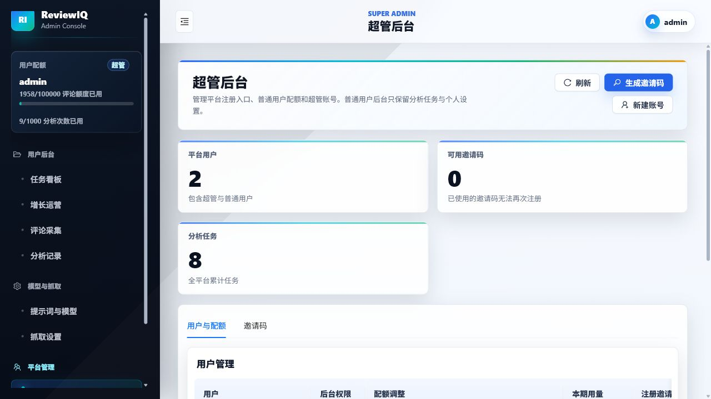
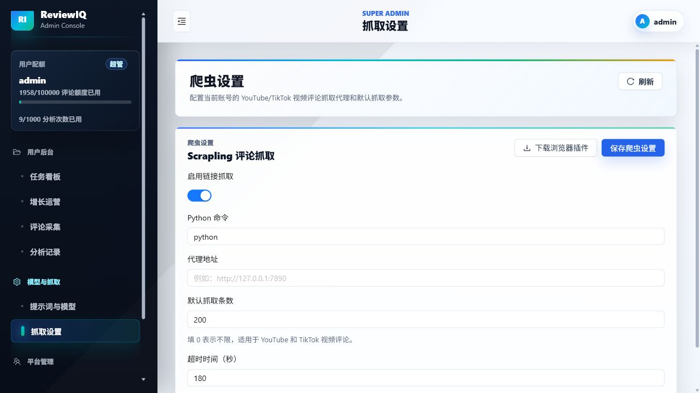

# ReviewIQ 评论分析系统使用手册

本文档面向系统使用人员和运营管理员，说明如何完成评论采集、AI 分析、评论检索、增长运营和后台管理。截图基于本地演示环境生成，线上环境中的数据、账号名称和额度数字会以实际部署为准。

本次更新覆盖 2026-06-26 前后的功能和 UI 调整，包括：评论明细高级筛选抽屉、移动端评论卡片、分析日志级别筛选、失败任务重试、采集/分析删除确认、行动看板响应式优化、后台按钮图标和全局按钮颜色调整。

## 1. 系统定位

ReviewIQ 是一个面向评论数据的采集与 AI 分析平台。系统可以把 YouTube、TikTok 等视频评论，以及其他业务来源的评论数据导入到平台中，统一进行情绪、NPS、用户声音、主题词、行动项和分析报告整理。

适用场景包括：

- YouTube 视频评论分析：适合内容选题反馈、舆情反馈、观众态度分析。
- TikTok 视频评论分析：适合短视频内容反馈、达人投放反馈、用户互动洞察。
- 商品评论分析：适合电商商品口碑、痛点、卖点和售后问题分析。
- 社媒评论分析：适合品牌声量、话题反馈和舆情监控。
- 定时监听：适合持续跟踪某条视频或内容链接的新评论。

## 2. 账号与权限

系统分为普通用户和超管两类。

普通用户主要使用评论采集、任务看板、分析记录、评论明细和增长运营功能。普通用户不需要也不应该维护模型、提示词、抓取参数等底层配置，系统会统一使用超管后台设置的配置。

超管可以管理用户、邀请码、工作区、AI 提示词与模型、抓取设置、额度等全局能力。只有超管账号会看到“提示词与模型”“抓取设置”“超管后台”等管理入口。

常见权限说明：

- 查看任务：查看当前工作区下的分析任务和采集任务。
- 创建采集：创建一次性采集任务或持续监听任务。
- 开始分析：将已采集到的评论提交给 AI 进行分析。
- 删除数据：删除评论采集记录或分析任务。删除后相关数据不可恢复，操作前请确认。
- 超管设置：仅超管可配置 AI、抓取、用户和额度。

## 3. 登录与进入系统

打开系统地址后进入登录页。

操作步骤：

1. 输入账号。
2. 输入密码。
3. 点击“登录”。
4. 登录成功后进入任务看板。

如果是本地开发环境，初始化账号通常由部署人员提供；演示环境可能使用 `admin / 123456`。生产环境请以实际创建的账号为准。

登录失败时可以按以下方向排查：

- 账号或密码是否正确。
- API 服务是否正常运行。
- 当前账号是否已被禁用。
- 浏览器本地缓存是否残留旧登录状态，可以退出后重新登录。

## 4. 首页：任务看板

任务看板用于查看当前账号和工作区的整体情况，包括任务总数、已完成分析、进行中的分析、最近任务和额度使用情况。

页面核心区域：

- 当前账号：显示当前登录用户、套餐等级和额度。
- 评论额度：显示当前周期已用评论数和总额度。
- 分析次数：显示当前周期已用分析次数和总额度。
- 任务总数：当前工作区下的分析项目数量。
- 已完成分析：最新分析已完成的任务数量。
- 进行中：排队或正在分析的任务数量。
- 最近分析任务：展示最近创建或更新的任务。

常用操作：

- 点击“刷新”：重新加载任务状态。
- 点击“分析记录”：进入所有分析任务列表。
- 点击最近任务中的“打开”：进入该任务的分析记录或详情页面。

建议工作流：

1. 每天先看任务看板，确认是否有失败或排队过久的任务。
2. 如果有新采集完成的数据，进入“评论采集”开始分析。
3. 分析完成后进入任务报告、评论明细或增长运营查看结果。

## 5. 评论采集

评论采集是系统最重要的入口之一，用于从视频链接采集评论，或者建立持续监听任务。

页面包含四类信息：

- 监听任务：正在持续跟踪的链接数量。
- 运行中：正在排队或抓取的采集任务数量。
- 已采集评论：当前账号下已入库的评论数量。
- 待处理异常：失败或需要排查的采集任务数量。

评论采集页分为两个列表：

- 持续监听任务：用于周期性自动抓取。
- 采集记录：用于查看每次抓取任务的状态和结果。

当前 UI 会把高频操作保留为直接按钮，例如“立即运行”“开始分析”“查看分析”；低频或危险操作会收纳到“更多”菜单中，例如“重试”“删除”。这样可以避免操作栏拥挤和按钮换行。

### 5.1 一次性采集

一次性采集适合临时分析某条视频或内容链接。

填写说明：

- 任务名称：建议写清楚平台、视频主题和日期，例如“王局拍案 YouTube 评论采集 20260616”。
- 内容名称：可选。如果不填，系统会尽量从页面标题识别。
- 视频链接：填写 YouTube 或 TikTok 视频链接。
- 来源渠道：选择 YouTube、TikTok 等来源。
- 分析类型：视频类评论请选择“视频类评论”。商品评论、社媒评论应选择对应类型，避免分析维度不匹配。
- 最多采集条数：控制本次最多抓取多少评论。填 `0` 表示不限制，但实际数量仍受平台、网络和抓取策略影响。

操作步骤：

1. 点击“评论采集”。
2. 点击“一次采集”。
3. 填写任务名称、链接、来源渠道和分析类型。
4. 设置最多采集条数。
5. 点击“开始采集”。
6. 在“采集记录”中查看进度。

采集状态说明：

- 排队中：任务已创建，等待 worker 执行。
- 抓取中：正在访问平台并提取评论。
- 已完成：评论已采集入库，可以开始分析。
- 失败：采集过程中发生异常，可以查看错误并点击“重试”。

### 5.2 持续监听

持续监听适合长期跟踪同一条视频或内容链接的新评论。系统会按设定频率自动抓取，并可选择抓取后自动分析。

填写说明：

- 监听名称：建议包含平台、对象和用途，例如“YouTube 新视频舆情监听”。
- 内容名称：可选，用于后续识别。
- 视频链接：填写要持续监听的链接。
- 来源渠道：选择评论来源平台。
- 分析类型：视频评论、商品评论、社媒评论等。
- 单次最多采集：每次运行最多抓取多少条评论。
- 运行频率：例如每 6 小时运行一次。
- 自动分析：开启后，每次采集完成会自动进入 AI 分析流程。

操作步骤：

1. 点击“新建监听”。
2. 填写监听信息。
3. 设置运行频率。
4. 根据需要开启“自动分析”。
5. 保存后在“持续监听任务”中查看。

监听任务操作：

- 启用/暂停：控制监听是否继续按频率运行。
- 立即运行：不等下一次计划时间，马上执行一次采集。
- 查看分析：进入监听任务关联的分析任务。
- 删除：删除监听任务。删除监听不会自动删除历史分析任务，具体以系统实现和提示为准。

### 5.3 浏览器插件采集

页面中提供“下载浏览器插件”按钮。插件适合在平台页面上辅助导出或采集评论数据。

使用建议：

- 如果平台限制较多，优先尝试插件方式。
- 下载后按部署人员提供的说明安装到浏览器。
- 插件导出的数据可以配合系统导入或采集流程使用。

### 5.4 失败重试与删除

当采集记录失败时，操作栏会显示“重试”。

建议排查顺序：

1. 链接是否可以在浏览器中正常打开。
2. 视频是否公开，是否需要登录或地区权限。
3. 抓取设置是否已启用。
4. 代理或网络是否正常。
5. 平台是否触发频率限制。

如果确认只是临时失败，可以点击“重试”。如果链接错误或任务不再需要，可以点击“删除”清理记录。

删除注意事项：

- 删除前确认该采集记录不再需要。
- 删除采集记录或监听任务时，系统会弹出确认窗口，请再次核对任务名称、链接和影响范围。
- 如果采集记录已经生成分析任务，删除采集记录不一定等同于删除分析任务。
- 如需清理分析结果，请到“分析记录”或任务相关页面删除对应分析任务。

## 6. 分析记录

分析记录用于查看已创建的分析任务、分析状态和运行日志。

主要字段：

- 任务：分析任务名称和内容对象。
- 来源：评论来自哪个平台或渠道。
- 类型：视频评论、商品评论或社媒评论。
- 导入状态：评论数据是否已经导入完成。
- 分析状态：AI 分析是否排队、运行、完成或失败。
- 创建时间：任务创建时间。
- 操作：打开、查看报告、删除等。

常见操作：

- 打开任务：进入任务详情。
- 查看分析：查看该任务的分析批次和日志。
- 删除任务：删除不再需要的分析任务。
- 重新分析：如系统提供入口，可基于已有评论重新发起 AI 分析。
- 查看日志：分析日志支持“全部 / 警告 / 错误”筛选，排查失败时建议先切到“错误”。
- 更多操作：操作栏会优先展示“打开”“查看分析”，报告、行动项、删除等低频操作可在“更多”菜单中找到。

分析状态说明：

- 未分析：评论已存在，但还没有发起 AI 分析。
- 排队中：分析任务已进入队列。
- 分析中：AI 正在处理评论。
- 已完成：分析报告已生成。
- 部分失败：部分数据处理失败，仍可能有可用结果。
- 失败：分析任务失败，需要查看日志或重试。

删除分析任务时，评论、分析结果、报告分享和行动项可能一并被删除。系统会使用站内确认弹窗提示影响范围，确认后再执行。

## 7. 分析报告

分析完成后，进入任务报告页查看 AI 输出结果。报告通常包括 NPS、情绪分布、核心主题、用户声音、痛点、机会点和行动建议。

报告阅读顺序建议：

1. 先看总体结论，确认用户态度是正向、中性还是负向。
2. 查看 NPS 和情绪分布，判断整体满意度。
3. 查看用户声音和高频词，理解评论主要讨论什么。
4. 查看痛点和机会点，判断哪些问题值得优先处理。
5. 进入评论明细，抽样核对原始评论是否支持结论。

重要说明：

- YouTube 视频类评论不等同于商品评论。分析类型选择“视频类评论”后，系统应围绕内容观点、人物态度、主题讨论、传播反馈等角度分析。
- 商品评论才更关注质量、物流、价格、售后、包装、使用体验等电商维度。
- 如果发现用户声音全部偏向电商词汇，优先检查该任务的分析类型和超管提示词配置。

## 8. 评论明细

评论明细用于查看原始评论和 AI 标注结果。

常用能力：

- 搜索：按关键词查找评论。
- 筛选：顶部保留情绪、意图、关键词等常用筛选；评分、媒体、来源渠道、分组、展示列等低频筛选放在“更多筛选”抽屉中。
- 表格列配置：根据当前工作需要调整展示字段。
- 保存视图：将当前筛选条件保存为常用视图。
- 导出：导出当前筛选结果。
- 人工修正：对 AI 判断错误的情绪、标签或摘要进行纠正。
- 移动端卡片：在手机上查看评论明细时，系统会以卡片和分页展示评论摘要、情绪、意图和时间，减少横向表格操作。

建议用法：

- 报告结论有疑问时，回到评论明细抽查原文。
- 做专题分析时，先筛选关键词，再保存视图。
- 交付外部报告前，导出关键评论作为证据。
- 发现 AI 误判时，使用人工修正沉淀反馈。

## 9. 增长运营

增长运营页用于把评论洞察转化为运营动作，例如内容选题、问题跟进、用户痛点处理和机会点管理。

常见用途：

- 查看近期用户反馈趋势。
- 对比不同任务或内容的反馈表现。
- 找到高优先级问题。
- 生成可执行的运营建议。
- 跟踪行动项处理状态。

行动项看板会按“未处理 / 处理中 / 已完成”等状态分列展示事项，支持修改状态、负责人、优先级和截止日期。中屏会保持两列统计卡片，手机端按钮会自动压缩成稳定布局，便于轻量跟进。

建议工作流：

1. 先从分析报告定位主要问题。
2. 进入增长运营查看系统整理的机会点。
3. 将可执行事项分配给负责人。
4. 定期复盘处理状态和后续评论变化。

## 10. 超管后台

超管后台用于管理平台级资源，包括用户、工作区、邀请码和配额。

常用管理项：

- 用户管理：创建用户、修改用户名称、设置是否为超管。
- 邀请码：创建邀请码，控制新用户注册。
- 工作区管理：创建或维护不同团队/客户的工作区。
- 额度管理：设置每月评论额度和分析次数额度。

建议：

- 普通用户不要开放模型和抓取设置。
- 不同客户或团队建议使用不同工作区隔离数据。
- 定期检查额度使用情况，避免任务失败时才发现额度不足。
- 生产环境不要使用简单密码。

## 11. 抓取设置

抓取设置由超管统一维护，普通用户不需要配置。

常见配置方向：

- 是否启用评论采集。
- 单次抓取数量上限。
- 抓取超时时间。
- 重试策略。
- 平台抓取参数。
- 代理或网络参数。

配置建议：

- YouTube 长评论区建议设置更高的超时时间和合理的最大采集数。
- 如果经常提示超时，应检查服务器网络、代理和平台限制。
- 如果只抓到少量评论，应检查滚动策略、抓取数量上限、平台排序和接口返回。
- 如果提示“未采集到评论”，优先确认链接公开性、评论区是否开启、平台是否需要登录。

## 12. AI 提示词与模型

AI 提示词与模型同样由超管统一维护。

配置时要特别注意分析类型：

- 视频类评论：关注观点、态度、争议点、内容反馈、人物/主题讨论、传播效果。
- 商品类评论：关注质量、价格、物流、售后、包装、使用体验。
- 社媒类评论：关注话题声量、舆情风险、品牌态度、传播路径。

如果视频类评论分析结果全部偏负向、NPS 长期为 0，或用户声音全是电商相关词，应优先检查：

1. 任务是否选择了“视频类评论”。
2. 超管提示词是否把所有评论都按商品评论处理。
3. 情绪评分规则是否过度惩罚争议、中性讨论或玩笑评论。
4. NPS 计算是否只按商品推荐意愿，而没有适配内容类评论。
5. 是否存在样本过少或评论采集不完整。

## 13. 移动端使用

系统会根据当前设备识别 PC 或移动端，并显示对应的界面布局。移动端主要用于查看状态、快速刷新、查看任务和轻量操作；复杂配置和大表格筛选更建议在 PC 上完成。

移动端建议：

- 使用顶部和底部可见入口进行导航。
- 大表格页面可以横向滚动查看字段，右侧淡出阴影表示还有内容可滑动。
- 评论明细在移动端会显示为卡片列表，并提供分页。
- 新建任务时尽量复制完整链接，避免手动输入错误。
- 删除、重试等关键操作前仔细确认当前任务名称。

## 14. 推荐日常流程

评论采集到分析的完整流程：

1. 登录系统。
2. 进入“评论采集”。
3. 选择“一次采集”或“新建监听”。
4. 填写链接、来源渠道和分析类型。
5. 等待采集完成。
6. 在采集记录中点击“开始分析”。
7. 进入“分析记录”查看分析进度。
8. 分析完成后打开报告。
9. 在“评论明细”中抽查原始评论。
10. 在“增长运营”中整理行动项。

持续监听的完整流程：

1. 进入“评论采集”。
2. 点击“新建监听”。
3. 设置运行频率和单次最大采集数。
4. 按需开启自动分析。
5. 定期查看监听任务是否运行正常。
6. 出现失败时点击“立即运行”或查看错误后重试。

## 15. 常见问题

### 15.1 登录接口返回 500

可能原因：

- API 服务异常。
- 数据库未启动。
- Prisma 查询引擎缺失或路径不正确。
- 环境变量未加载。

处理建议：

- 先检查 API 健康接口。
- 查看 API 日志。
- 确认数据库连接。
- 本地 Windows 环境注意 Prisma engine 是否能被服务进程找到。

### 15.2 Scrapling crawler timed out

可能原因：

- 目标平台加载慢。
- 服务器网络访问 YouTube/TikTok 不稳定。
- 代理不可用。
- 抓取数量过大。
- 页面滚动加载耗时超过配置。

处理建议：

- 降低单次最大采集数后重试。
- 检查服务器网络和代理。
- 增加抓取超时时间。
- 使用持续监听分批采集。

### 15.3 提示未采集到评论

可能原因：

- 视频没有公开评论。
- 评论区关闭。
- 链接不是支持的视频详情页。
- 平台需要登录或地区权限。
- 抓取脚本没有滚动到评论区域。

处理建议：

- 在浏览器中打开链接确认评论可见。
- 换一个公开链接测试。
- 检查抓取设置是否启用。
- 查看 worker 日志定位具体错误。

### 15.4 只采集到很少评论

可能原因：

- 单次最大采集数设置过低。
- 平台页面只加载了部分评论。
- 抓取过程提前停止。
- 排序方式影响可见评论数量。
- 平台限制了未登录访问。

处理建议：

- 提高最大采集条数。
- 使用持续监听分批抓取。
- 检查抓取日志中的进度和停止原因。
- 确认是否存在平台访问限制。

### 15.5 AI 分析结果明显不对

可能原因：

- 分析类型选择错误。
- 提示词不适配当前评论类别。
- 评论样本过少或偏差较大。
- 原始评论语言、语气、讽刺和玩笑较多。

处理建议：

- 视频评论选择“视频类评论”。
- 商品评论选择“商品类评论”。
- 让超管检查提示词和模型配置。
- 在评论明细中抽查原文，必要时人工修正。

## 16. 操作注意事项

- 删除操作请谨慎，删除后通常不可恢复。
- 删除或撤销分享时，系统会显示站内确认弹窗；确认前请阅读弹窗中的影响范围。
- 新建采集时务必选择正确的分析类型。
- 不同平台链接不要混用来源渠道。
- 大规模采集建议分批运行，避免超时。
- 普通用户不需要维护模型和抓取设置。
- 超管调整提示词后，建议用少量任务先验证效果。
- 对外分享报告前，先检查是否包含敏感评论或内部数据。

## 17. 术语表

- 任务：一次评论导入或采集后形成的分析对象。
- 采集记录：一次抓取执行记录。
- 监听任务：按固定频率自动抓取的长期任务。
- 分析记录：AI 对评论执行分析的运行记录。
- NPS：净推荐值，用于衡量整体推荐倾向。视频类评论中应按内容推荐或态度倾向解释。
- 用户声音：评论中反复出现的观点、需求、痛点或主题。
- 行动项：从评论洞察中拆解出的可执行事项。
- 工作区：用于隔离团队、客户或项目数据的空间。
